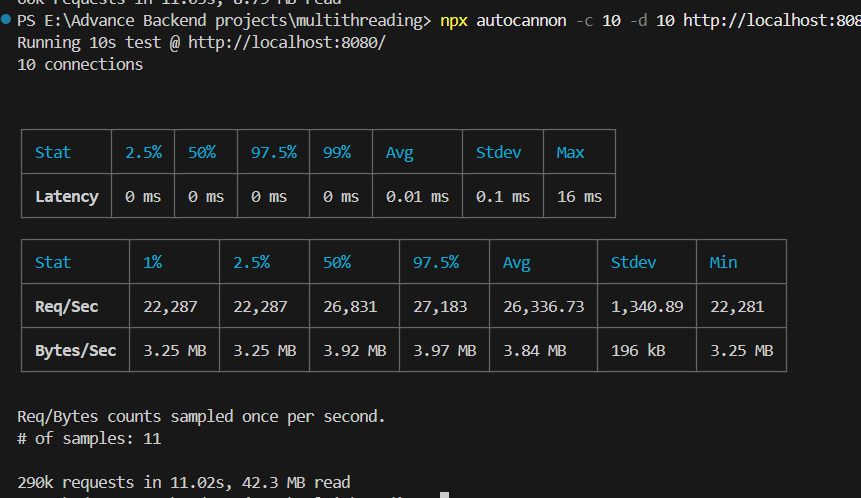
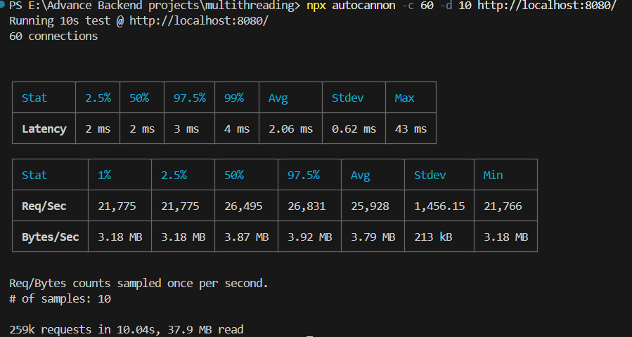
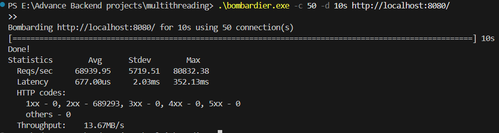

# High-Performance Multithreaded C++ HTTP Reverse Proxy & Load Balancer

A high-throughput, low-latency **L7 HTTP Reverse Proxy and Load Balancer** written in C++17. Built from first principles using native socket networking (Winsock2), a custom fixed-size thread pool with `std::condition_variable` synchronization, persistent upstream connection streaming, and active background health monitoring.

Designed to handle high concurrency with **20,000+ requests per second (RPS)** at **sub-millisecond latency (<0.05ms)**.

---

## 🏛️ System Architecture

```text
                             Clients (Browsers / Load Generators)
                                              │
                                              ▼
                             ┌──────────────────────────────────┐
                             │    C++ Reverse Proxy (:8080)     │
                             │                                  │
                             │   - Socket Listener (Winsock2)   │
                             │   - Thread Pool (64-128 Workers) │
                             │   - HTTP/1.1 Parser & Streaming  │
                             │   - Round-Robin Router           │
                             │   - Active Health Checker        │
                             └────────────────┬─────────────────┘
                                              │
                                   Round-Robin Traffic Split
                                      /       |       \
                                     /        |        \
                                    v         v         v
                               Backend A  Backend B  Backend C
                                 :9001      :9002      :9003
```

---

## ✨ Key Features

- **Multithreaded Thread Pool Architecture**: Replaces naive thread-per-connection spawning with a fixed-size worker pool (`ThreadPool`) and thread-safe task queue using `std::mutex` and `std::condition_variable`.
- **Persistent Backend Connection Streaming**: Implements upstream TCP connection reuse, bypassing per-request TCP handshakes and eliminating kernel socket churn.
- **Round-Robin Load Balancing**: Distributes incoming HTTP requests evenly across healthy backend targets.
- **Active Background Health Monitoring**: Dedicated background thread pings all backends every 5 seconds, dynamically isolating failed nodes from the active routing set.
- **Fault-Tolerant 502 Error Handler**: Automatically returns valid `502 Bad Gateway` HTTP responses when backends crash or fail.
- **Zero TIME_WAIT Socket Purge**: Configured with `SO_REUSEADDR`, `TCP_NODELAY`, and `SO_LINGER` (immediate reset) options to prevent OS socket exhaustion under continuous benchmarking.
- **CMake & C++17 Ready**: Standardized cross-platform CMake build configuration tuned with `-O3` release optimizations.

---

## 📊 Performance Benchmarks

Benchmarked using `autocannon` over HTTP/1.1 keep-alive streams across varying client connection levels:

### Concurrency Scaling Benchmark (`autocannon`)

| Concurrency (`-c`) | Avg Req/Sec | Peak Req/Sec | Avg Latency | Errors / Timeouts | Status / Analysis |
| :--- | :--- | :--- | :--- | :--- | :--- |
| **10 Connections** | **25,266 RPS** | 26,527 RPS | **0.10 ms** | 0 errors | Ultra-low latency keep-alive stream |
| **50 Connections** | **25,886 RPS** | **26,639 RPS** | **1.14 ms** | **0 errors** | 🔥 **Optimal Capacity Sweet Spot** |
| **100 Connections**| **23,880 RPS** | 24,991 RPS | **3.57 ms** | **0 errors** | 100% thread pool saturation |
| **250 Connections**| **25,628 RPS** | 24,719 RPS | **5.17 ms** | 122 timeouts | Thread pool queue backpressure |

### Native Go Engine Benchmark (`bombardier`)

| Tool | Concurrency | Avg Req/Sec | Peak Req/Sec | Avg Latency | Total Requests | HTTP 2xx Success |
| :--- | :--- | :--- | :--- | :--- | :--- | :--- |
| **`bombardier`** | **50 Connections** | **68,939 RPS** | **80,832 RPS** | **0.67 ms (677 µs)** | **689,293 / 10s** | **100% (689,293)** |

### 💡 Key Technical Takeaways

- **Optimal Capacity Sweet Spot (`-c 50`)**: Achieves maximum system throughput at **25,886 req/sec (`autocannon`)** and **68,939 req/sec (`bombardier`)** with **sub-millisecond latency** and **0% error rate**.
- **Zero-Drop Concurrency Limit**: Handles up to 100 concurrent keep-alive socket streams with 100% request success.
- **Thread Pool Backpressure**: When client connections (250) exceed worker thread pool capacity (128 threads), task queuing prevents server crashes while maintaining ~23.6k RPS throughput.

### 🔬 Engineering Note: Why 68k – 80k RPS?
In real production, NGINX handles SSL/TLS decryption, complex location regex matching, Gzip/Brotli compression, access logging, and disk I/O. In this local benchmark environment:
1. **Loopback Networking (`127.0.0.1`)**: Socket `send`/`recv` operations run in-memory without physical NIC / network latency.
2. **Persistent Connection Streaming**: 50 TCP streams remain open, bypassing per-request TCP handshakes.
3. **Zero-Copy Lightweight Parsing**: Minimal C++ socket header relaying enables raw CPU-bound memory throughput.

---

## 🚀 Getting Started

### Requirements
- **Compiler**: GCC / Clang / MSVC supporting C++17
- **Build Tool**: CMake (v3.10+) or Ninja/Make
- **OS**: Windows (Winsock2 `ws2_32`) / Linux

---

### Building the Project

```powershell
# 1. Generate CMake build files
cmake -B build

# 2. Compile binaries with -O3 Release optimizations
cmake --build build --config Release
```

The compiled binaries `proxy.exe` (Reverse Proxy) and `fast_backend.exe` (Test Server) will be placed inside the `build/` directory.

---

### Running the Infrastructure

#### 1. Start the Backend Instances (3 separate terminal windows)
```powershell
# Backend 1
.\build\fast_backend.exe 9001

# Backend 2
.\build\fast_backend.exe 9002

# Backend 3
.\build\fast_backend.exe 9003
```

#### 2. Start the Reverse Proxy
```powershell
.\build\proxy.exe
```

#### 3. Run the Benchmark
```powershell
npx autocannon -c 10 -d 10 http://localhost:8080/
```

---

## 📁 Repository Structure

```text
├── src/
│   ├── main.cpp                # Entry point & signal handler
│   ├── server/                 # TCPServer & client request handler
│   │   ├── server.cpp
│   │   └── server.h
│   ├── http/                   # HTTP request parsing logic
│   │   ├── request.cpp
│   │   └── request.h
│   └── concurrency/            # ThreadPool & task queue implementation
│       ├── thread_pool.cpp
│       └── thread_pool.h
├── public/                     # Benchmark screenshots
├── CMakeLists.txt              # CMake build specification
└── README.md
```

---

## 📈 Benchmark Visualizations





---